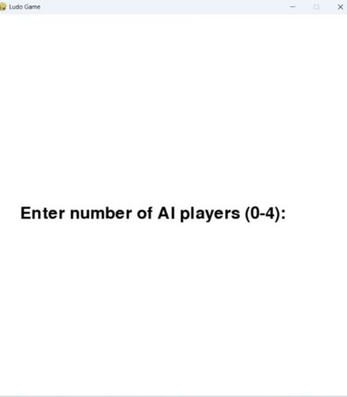
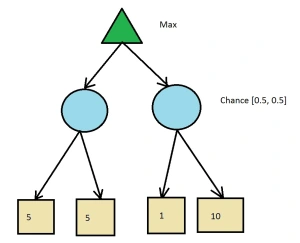

- [Introduction](#introduction)
- [Installation](#installation)
- [Game Setup](#game-setup)
- [Running the Game](#running-the-game)
- [Game Play](#game-play)
- [Expectimax Algorithm](#expectimax-algorithm)
- [Architecture](#architecture)
- [Conclusion](#conclusion)
  

## Introduction 

This project is a Ludo game developed using Python's Pygame library. The primary objective is to simulate a playable Ludo game where AI and human players can participate. The game logic includes movement rules, safe zones, token captures, and a strategic AI decision-making process using the Expectimax Algorithm. The AI players make calculated moves by evaluating board positions and potential future scenarios, providing a challenging and engaging experience.

## Installation
Before running the game, ensure you have the required libraries installed:
~~~bash
pip install pygame 
~~~

## Game Setup
The game consists of four players (Blue, Red, Yellow, Green), each with four tokens. The game board follows the traditional Ludo format and includes:

-A start position for each player where tokens begin.

-A home column where each player must move their tokens to win.

-Safe zones, which provide protection from opponent captures.

-A structured path leading from the start position to the center.

## Ludo Board
The ludo board consists of a cross-shaped layout with four colored bases, a central home area, and designated path for each player's tokens.

 
## Running the Game
To start the game, run the main Python script:
~~~bash
python game.ipynb
~~~

Players can configure the game by selecting the number of AI-controlled players, ranging from 0 to 4. If 0 is chosen, all players will be human-controlled, whereas selecting 4 will result in a fully AI-driven game. Any number in between allows for a mix of human and AI participants, providing flexibility in gameplay. The AI will take control of the remaining players based on the selected configuration

## Game Play 

-   Ludo involves racing tokens around the board to reach the center.

-   Each player has four tokens of a distinct color.

-   Tokens start in a designated home area and must travel around the
    board.

-   The primary goal is to move all tokens from the starting area to the
    center.

-   Tokens move based on dice rolls, and the first player to get all
    tokens home wins.

-   Safe zones provide protection for tokens from being captured by
    opponents.

-   Capturing occurs when a token lands on a space occupied by an
    opponent\'s token, sending the opponent\'s token back to its home
    area.

-   Dice rolls introduce chance, but strategic decisions include which
    token to move based on the current board position and potential
    future moves.

-   Players can block opponents by clustering tokens together,
    preventing them from making progress.

-   Defensive play involves protecting tokens by positioning them
    strategically within safe zones.

-   Players can adopt aggressive strategies by aiming to capture
    opponent tokens, risking their own tokens in the process.

-   Calculated risk-taking involves choosing between safe moves and
    riskier but potentially rewarding actions.

-   As tokens approach the home stretch, decision-making becomes
    crucial, maximizing dice rolls to precisely enter the

## Game Win
A player wins the game when all four of their tokens successfully reach the home area. Once this condition is met, the game ends.

## Expectimax Algorithm  

The Expectimax Algorithm in game theory is a decision-making algorithm used for games with two players (MAX) and random events (chance nodes). It evaluates a game tree by:

- Maximizing the payoff at MAX nodes (best move for MAX).
- Computing the expected value at chance nodes based on probabilities of random outcomes. It returns the optimal move for MAX, considering both strategic 
  choices and randomness.

  

#### How It Works in Ludo
- The AI evaluates all possible moves based on the current game state.
- Since Ludo involves rolling a six-sided die, the algorithm accounts for all possible dice outcomes and their probabilities.
- It simulates different future game states, factoring in both its own moves and potential opponent responses.
- A heuristic function is used to evaluate board positions, considering factors like token safety, progress toward home, and risk of capture.
- The AI selects the move that maximizes the expected value, ensuring an optimal balance between aggressive advancement and defensive play

### State Representation

-   In our Ludo project, states represent the current board
    configuration, including token positions, safe zones, and opponent
    tokens.

-   Current Player: An integer representing the current player\'s index
    (0 for red, 1 for green, 2 for yellow, 3 for blue).

-   Dice Number: The number obtained from rolling the dice, ranging from
    1 to 6.

-   Token Positions: A nested list representing the positions of all
    tokens on the board. Each player has four tokens, and each token\'s
    position is a pair of coordinates (x, y) on the game board.

### Actions:

In this Ludo game, actions correspond to the movement of a player\'s
tokens based on the dice roll. There are four possible actions, one for
each token a player can move. The specific action taken depends on
several factors:

-   Dice Roll: The number rolled on the dice influences which tokens can
    be moved.

-   Token Position: Whether a token is in the home, on the board, or on
    the way to the winner\'s rank.

-   Game Rules: Certain rules, like needing a six to move a token out of
    home or only being able to move tokens within the board\'s paths,
    constrain possible actions

## Architecture
Game Engine

- Pygame Library: Handles graphics rendering, user interactions, and event handling.

- Game Board Representation: Implemented using a grid-based system where each tile corresponds to a specific position in the game.

AI Strategy - Expectimax Algorithm

- State Representation: Captures the current board state, including token positions, dice roll outcomes, and possible moves.

- Action Selection: The AI evaluates all possible moves, assigns weights based on game rules, and selects the best possible move.

- Heuristic Evaluation: AI uses heuristic scoring to evaluate board positions, considering safety, risk, and game progress.
### Expectimax Algorithm in Ludo AI
The Expectimax Algorithm is used to enhance AI decision-making by considering both strategic planning and probabilistic outcomes of dice rolls in the game.

This approach allows the AI to make more strategic decisions by predicting the long-term impact of its moves in an uncertain environment.

## Conclusion

This project showcases an interactive Ludo game with AI integration, leveraging the expectimax algorithm to enhance decision-making. The AI component evaluates all possible moves while considering probabilities and uncertainties, allowing for more strategic and adaptive gameplay. By simulating intelligent decision-making, the AI creates a challenging and competitive environment for both human and AI-controlled players. The use of expectimax ensures that the AI can anticipate various outcomes based on probabilistic reasoning, making its moves more calculated and efficient. This combination of strategic planning, probabilistic analysis, and adaptive decision-making modernizes the classic Ludo experience, offering a more engaging and dynamic gameplay experience enriched by advanced AI techniques.
